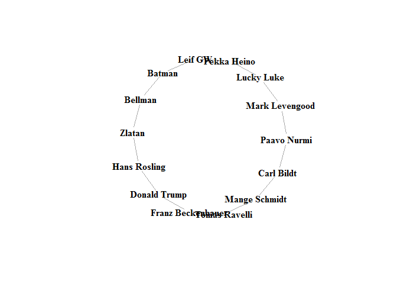

Seating Game
================
Nils Randau
22 oktober 2017

This is a game to randomly assign seating at parties and get-togethers in a fun way. The basic idea is to make people mix and mingle through role playing. It is divided into two phases:

<b>Phase1</b>: Each player receives a character that they are to play throughout the game. Now they are to move around the floor and act as if they are their character. Ideally, they should not give away their identity in a too obvious way. Try to imitate the characters general personality traits at first and only give away obvious attributes later on.

Note: If the player does not recognize the character, he can request a new one. This should be done as soon as possible, as minumum before the end of phase 1.

<b>Phase2</b>: When phase 2 starts, each player receives two characters that they are to look for. E.g., they may receive "James Bond" on their left hand side and "Dalai Lama" on their right. Now they should try to find these characters by observing and asking questions to the people around them. Once found, they are to lock arms and continue looking together for the person at the end of each side of their "chain". This continues until the whole group is arm-locked together and a big circle is formed.

<b>Example</b> Below is an example of a game played between 14 players. The diagram illustrates how all characters relate to each other. The table shows what individual players will see on their screens, where each row shows the perspective for any individual player.

| Left Hand         | Player            | Right Hand        |
|:------------------|:------------------|:------------------|
| Mark Levengood    | Paavo Nurmi       | Carl Bildt        |
| Paavo Nurmi       | Carl Bildt        | Mange Schmidt     |
| Carl Bildt        | Mange Schmidt     | Tomas Ravelli     |
| Mange Schmidt     | Tomas Ravelli     | Franz Beckenbauer |
| Tomas Ravelli     | Franz Beckenbauer | Donald Trump      |
| Franz Beckenbauer | Donald Trump      | Hans Rosling      |
| Donald Trump      | Hans Rosling      | Zlatan            |
| Hans Rosling      | Zlatan            | Bellman           |
| Zlatan            | Bellman           | Batman            |
| Bellman           | Batman            | Leif GW           |
| Batman            | Leif GW           | Pekka Heino       |
| Leif GW           | Pekka Heino       | Lucky Luke        |
| Pekka Heino       | Lucky Luke        | Mark Levengood    |
| Lucky Luke        | Mark Levengood    | Paavo Nurmi       |
